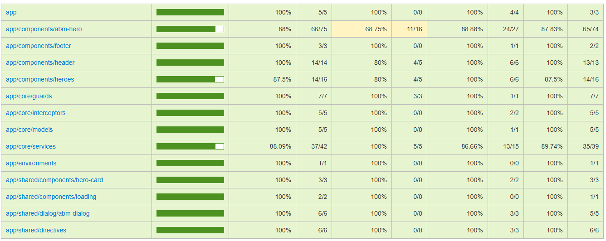

# Documentación

Proyecto creado con Angular 17 en la cual se realiza un CRUD (Create, Reed, Update and Remove) de heroes con un Listado de los mismos.

`
  Datos al bucket de firebase en environments/environment.ts (por favor no compartir)
`

---

### Implementaciones

- Signals - control de estados con signals
- Inject en lugar de constructor
- Interceptor loading para servicios de ABM
- Material Angular (tema personalizado styles.scss)
- Directiva para inputs (UpperCase)
- Componente reutilizable (Component Input Binding)
- Proyecto con unit test en un __97.40%__ (statements: 91.57%, branches: 79.41%, functions: 92.95%, lines: 91.66%).

---

### Como correr el proyecto

1. Tener instalado Node 18.20.4
2. Correr el comando `npm install` en la terminal, ubicado en la carpeta raiz del proyecto.
3. Correr el comando `npm run server` en una terminal aparte ubicado en la carpeta raiz del proyecto para correr el "servidor" con *json-server*. `IMPORTANTE`
4. Correr el comando `npm start` para que se inice el proyecto y se abra automaticamente en su navegador predeterminado.

#### Para correr los test
1. Ejecutar el comando `npm run test --code-coverage` en la terminal, ubhicado en la carpeta raiz del proyecto.

---

## ***Arquitectura del proyecto***
### Componentes

`src/app/components`

- ***Heroes*** - Componente que hace un listado de HeroCard
- ***AddEditHero*** - Componente reutilizable para agregar o editar un heroe
- ***HeroCard*** - Tarjeta de visualizacion para listado de heroes (hecho manualmente, sin librerias)
- ***Header*** que contiene buscador de heroes
- ***Footer*** que contiene link del repositorio de github
- ***Loading*** componente de carga para usar con el interceptor

### Core

`src/app/core`
#### Servicios

- ***HeroesService*** - Servicio para ABM de heroes y carga de imagen a firebase
- ***LoadingService*** - Servicio utilizado para manerjar estado de isLoading

#### Interceptor
- ***LoadingInterceptor*** - Interceptor para handlear las peticiones con LoadinService (contiene un delay de 500ms para poder apreciar mejor app-loading)

#### Guard
- ***HeroesGuard*** - Guard creado con el objetivo de que heroes siempre contenga query params para paginacion `/heroes?page=1`

#### Models
- ***HeroModel*** - Contiene interface Hero y class HeroModel

### Shared
`src/app/shared`
- ***Components*** contiene componentes mapeables como HeroCardComponent y LoadingComponent.
- ***Dialog*** contiene el componente para utilizar con MatDialog en el metodo DELETE de un heroe.
- ***Directives*** contiene la directiva UppercaseInputDirective para que el texto dentro de un input se mantengan en mayusculas.

---
Nota: cualquier comentario o feedback es bienvenido, me diverti codeando unas horas con este desafio, ¡gracias por su tiempo!

